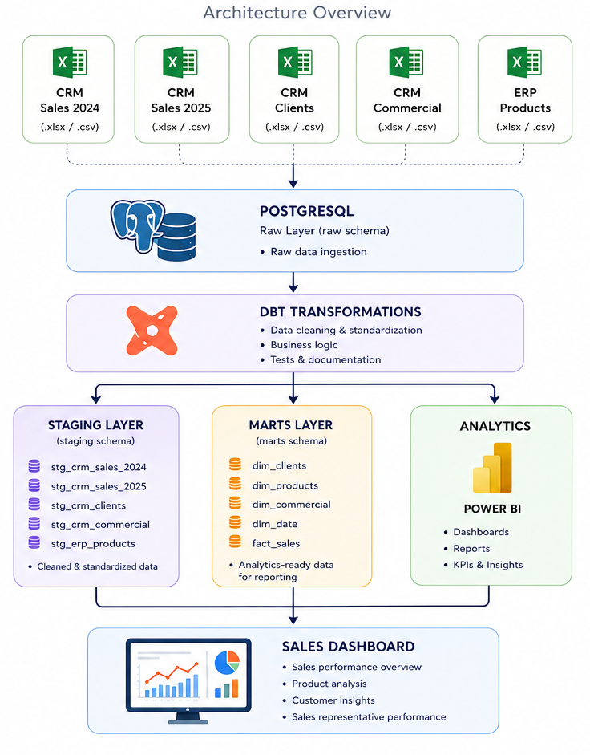
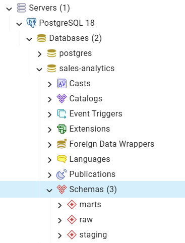
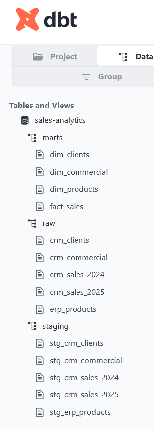
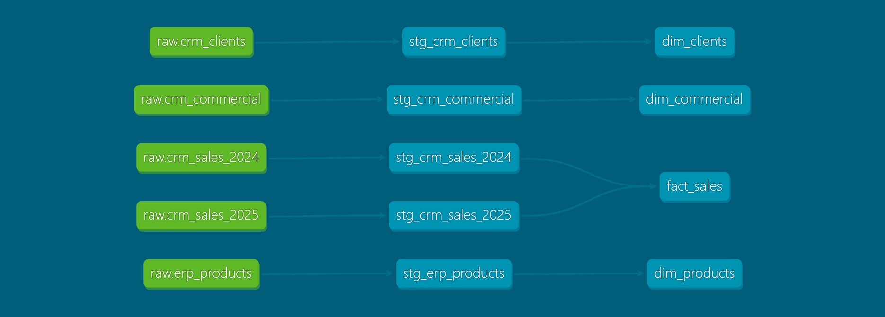
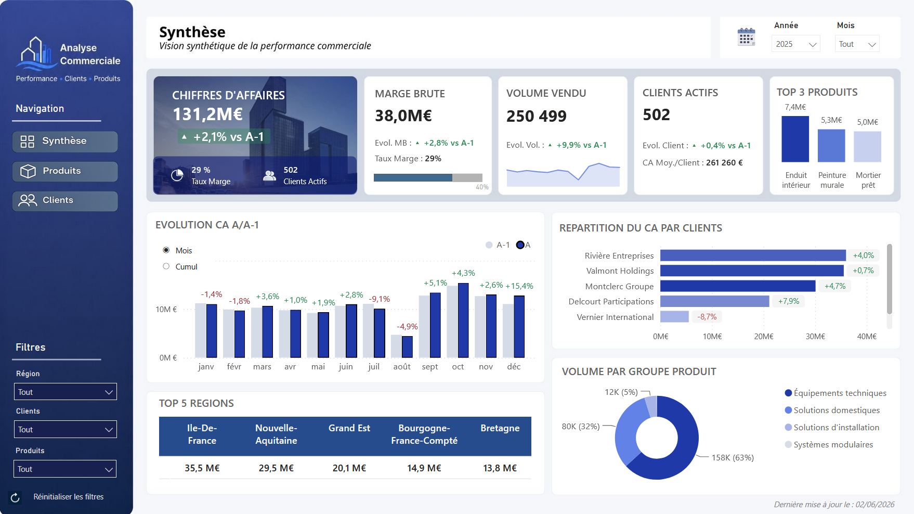
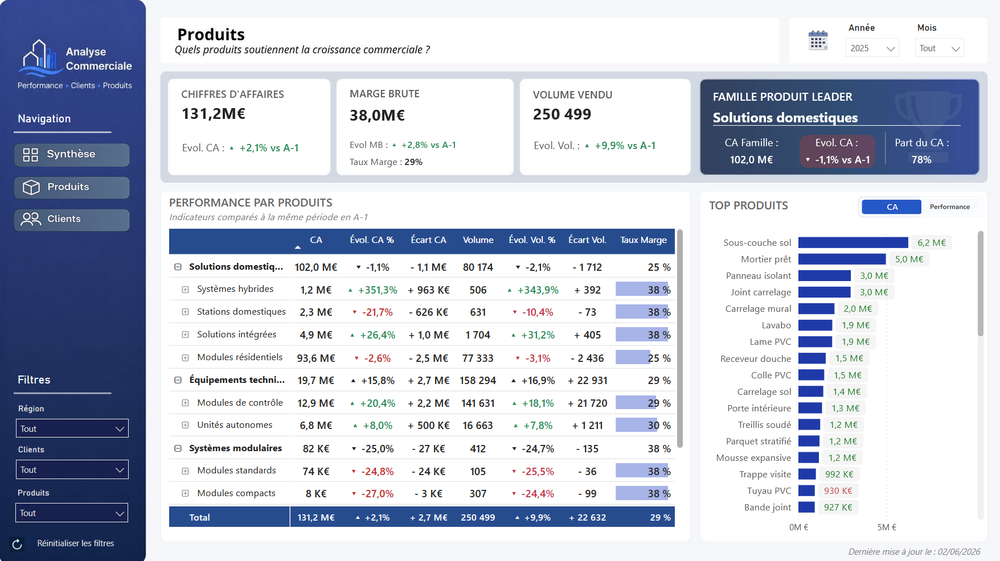
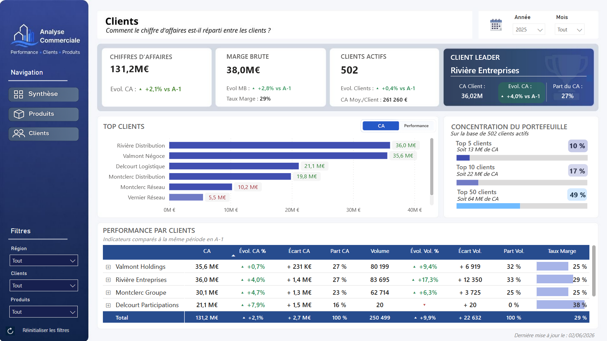

# 📊 Sales Analytics ELT Project

## End-to-End Analytics Pipeline with PostgreSQL, dbt and Power BI

*Building an analytics workflow from raw CRM/ERP data to business-ready dashboards.*

---

## 🎯 Project Overview

This project simulates a real-world sales analytics environment by integrating CRM and ERP datasets into an ELT workflow.

Raw customer, product, sales and sales representative datasets are loaded into PostgreSQL, transformed and validated using dbt, then organized into a clean and analytics-ready data model.

The resulting data model is designed to support sales reporting and analysis across customers, products, sales representatives and time periods, while providing a reliable foundation for Power BI dashboards.

## 🎥 Dashboard Demonstration

Short walkthrough of a Power BI sales analytics dashboard built on top of a PostgreSQL and dbt ELT pipeline.

🔍 For optimal readability of KPIs, charts and tables, please watch the video in the highest available quality.

---

## 🏗 Architecture

---

## 📦 Data Sources

The project uses five anonymous datasets inspired by a real-world commercial environment:

| Dataset | Description |
|----------|-------------|
| crm_clients | Customer hierarchy and geographic information |
| crm_commercial | Sales representative information |
| crm_sales_2024 | Sales transactions for 2024 |
| crm_sales_2025 | Sales transactions for 2025 |
| erp_products | Product catalog and attributes |

---

## 🐘 PostgreSQL Schema

PostgreSQL serves as the central storage layer of the project.

The database is organized into three schemas that separate data ingestion, transformation and analytical consumption:

| Schema | Purpose |
|----------|----------|
| **raw** | Stores the original source datasets imported from CRM and ERP files |
| **staging** | Contains cleaned and standardized datasets created by dbt staging models |
| **marts** | Contains business-oriented analytical models used for reporting and analysis |

### Database Structure

---

## 🔄 Data Transformation with dbt

The project follows a layered modeling approach, separating data preparation from business-oriented analytical models.

### Staging Layer

The staging layer is responsible for preparing source data before analytical modeling.

Key transformations include:

- Standardization of column names and data types
- Removal of empty values and unnecessary spaces
- Harmonization of textual attributes
- Addition of technical metadata fields
- Source documentation and testing through dbt YAML files

The following staging models were created:

| Model | Description |
|---------|-------------|
| `stg_crm_sales` | Cleans and standardizes sales transactions |
| `stg_crm_clients` | Standardizes customer hierarchy attributes |
| `stg_crm_commercial` | Cleans sales representative information |
| `stg_erp_products` | Standardizes product catalog attributes |

### Mart Layer

The mart layer contains business-oriented analytical models designed for reporting and dashboarding.

It consists of three dimension tables and a central fact table used for sales analysis.

#### Dimension Tables

| Model | Description |
|---------|-------------|
| `dim_clients` | Customer hierarchy and segmentation |
| `dim_products` | Product catalog and product attributes |
| `dim_commercial` | Sales representative information |

#### Fact Table

| Model | Description |
|---------|-------------|
| `fact_sales` | Central sales transaction table containing measures and foreign keys |

*This structure enables simplified business analysis and seamless integration with Power BI.*

### dbt Documentation

## 📚 Data Lineage & Testing

dbt automatically generates project documentation from model definitions and YAML metadata.

### Data Lineage

### Data Quality Tests

Data quality is enforced through tests defined in YAML configuration files.

Implemented validations include:

- Unique key checks
- Null value detection
- Referential integrity validation
- Source consistency controls

All tests successfully passed during project execution.

## 📊 Power BI Dashboard

The final stage of the project consists of developing an interactive Power BI reporting solution built on top of the analytical models generated throughout the PostgreSQL and dbt workflow.

The report was designed for sales teams and sales managers who need to quickly analyze business performance without requiring advanced Power BI knowledge.

Particular attention was given to user experience, dashboard readability and navigation simplicity in order to make the report accessible to all business users.

---

## 🎨 Reporting Design & User Experience (UX/UI)

The objective was not only to create visualizations, but to build a decision-support tool that can be easily used on a daily basis.

Several design choices were implemented to improve usability and facilitate data interpretation:

- Custom side navigation menu across report pages
- Consistent visual identity throughout the report
- KPI cards highlighting key business indicators
- Conditional formatting to quickly identify performance trends
- Dedicated reading guides ("Key Reading") to support data interpretation (see demonstration video)
- Deliberate use of simple and intuitive visualizations for non-technical users
- Consistent page layouts to reduce the learning curve

Visualizations were selected with a business-first approach, prioritizing clarity and usability over visual complexity.

---

## 📋 Executive Overview

The overview page provides a high-level view of commercial performance through key business indicators.

It allows users to monitor:

- Sales revenue
- Gross margin
- Sales volume
- Number of active customers
- Year-over-Year revenue evolution
- Main revenue contributors
- Revenue distribution across key customers

---

## 📦 Product Analysis

This page is dedicated to product performance analysis.

It relies on a product hierarchy that enables navigation across multiple levels of granularity to identify the best-performing product families, sub-families and products.

Key capabilities include:

- Hierarchical drill-down navigation
- Revenue and volume analysis
- Year-over-Year comparison
- Margin monitoring
- Identification of top-performing products and product families

---

## 👥 Customer Analysis

This page focuses on customer portfolio analysis and revenue distribution across customers and customer groups.

It highlights portfolio concentration and the contribution of key accounts to overall business performance.

Key capabilities include:

- Customer ranking
- Portfolio concentration analysis
- Revenue contribution monitoring
- Customer performance comparison
- Identification of strategic customers

---

## ⚙️ Interactive Features

Several advanced features were implemented to improve data exploration and user experience:

- Dynamic slicers (Year, Month, Region, Customer and Product)
- Hierarchical drill-down navigation within matrices and charts
- Bookmark-driven switching between analytical views
- Dynamic display of indicators in value or performance mode
- Toggle button for monthly versus cumulative analysis
- Cross-filtering between visualizations
- Dynamic conditional formatting
- KPI cards with Year-over-Year comparisons

---

## 📈 Business Metrics

The report includes numerous business indicators designed to support commercial decision-making. The list below highlights some of the main KPIs available throughout the dashboard and is not exhaustive.

| KPI | Description |
|------|------------|
| Sales Revenue | Total revenue generated from sales |
| Gross Margin | Margin generated from sales activities |
| Sales Volume | Total quantity sold |
| Active Customers | Number of customers generating sales |
| Revenue Growth (%) | Revenue evolution compared to the previous year |
| Revenue Variance | Revenue difference compared to the previous year |
| Margin Rate | Margin expressed as a percentage of revenue |
| Revenue Share | Contribution to total revenue |
| Volume Share | Contribution to total sales volume |

